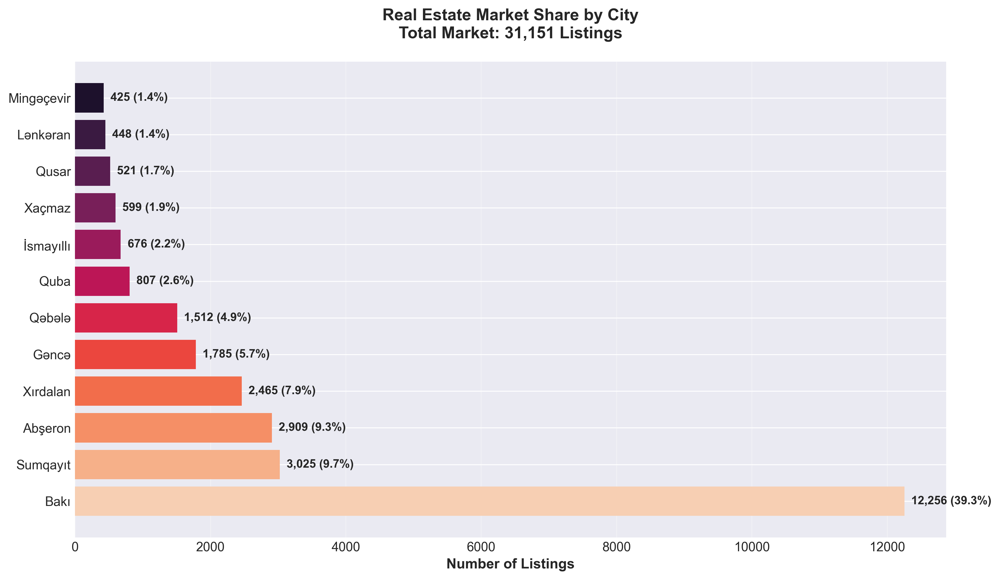
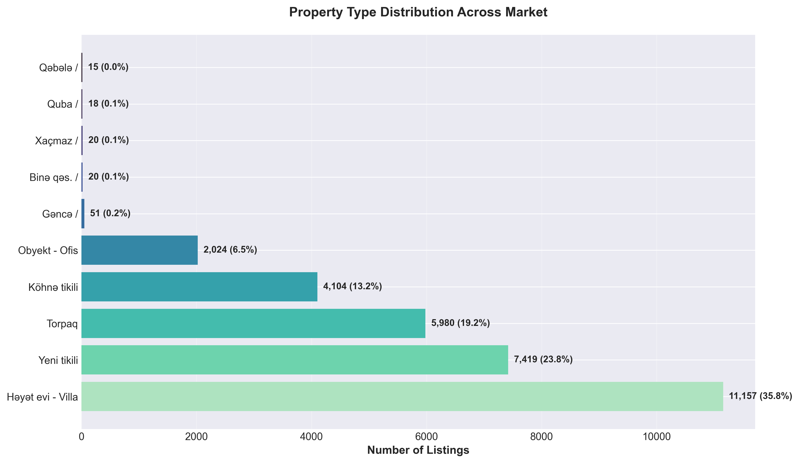
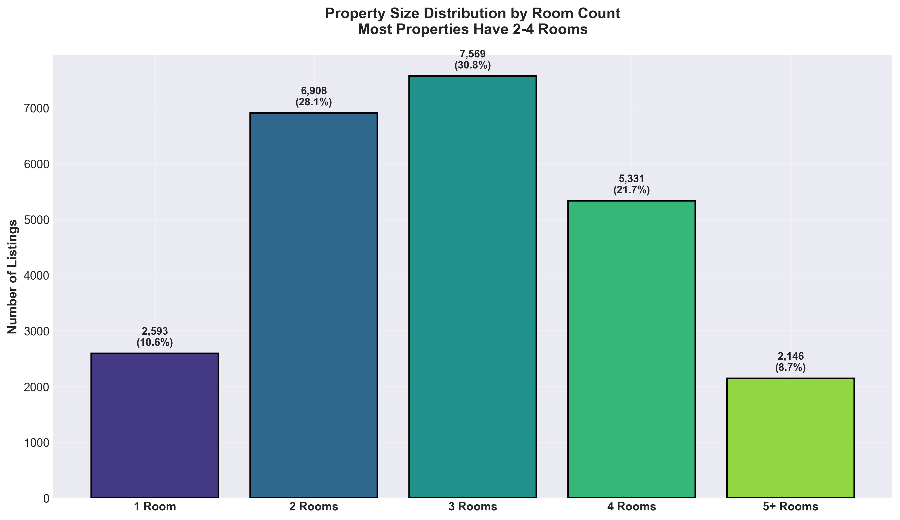
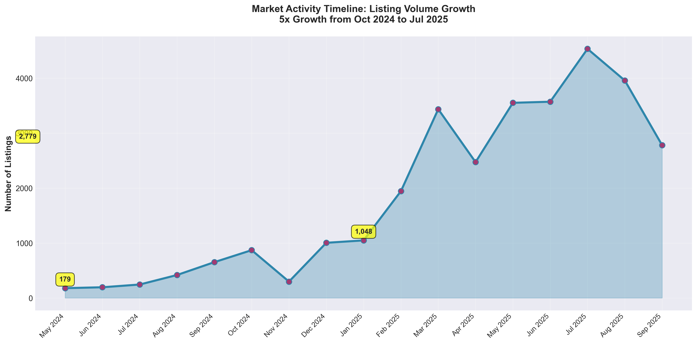
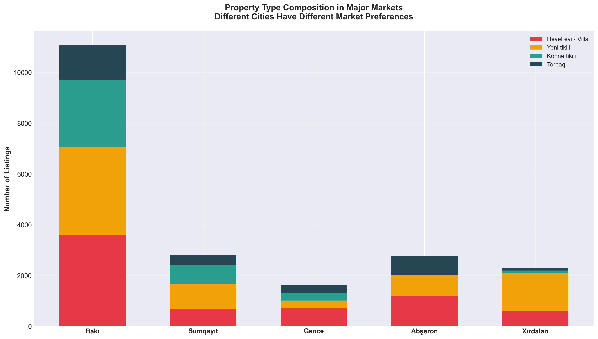
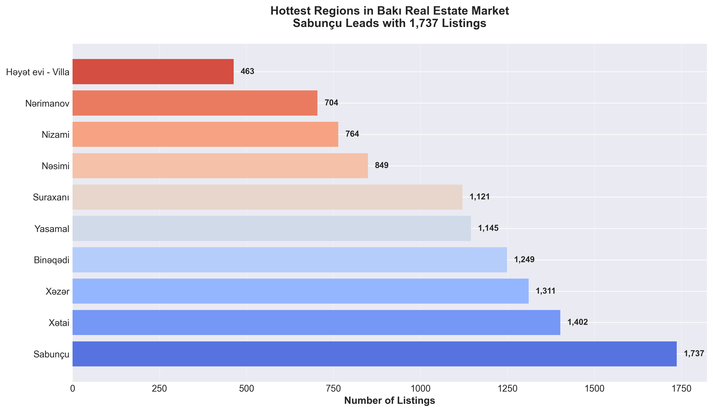
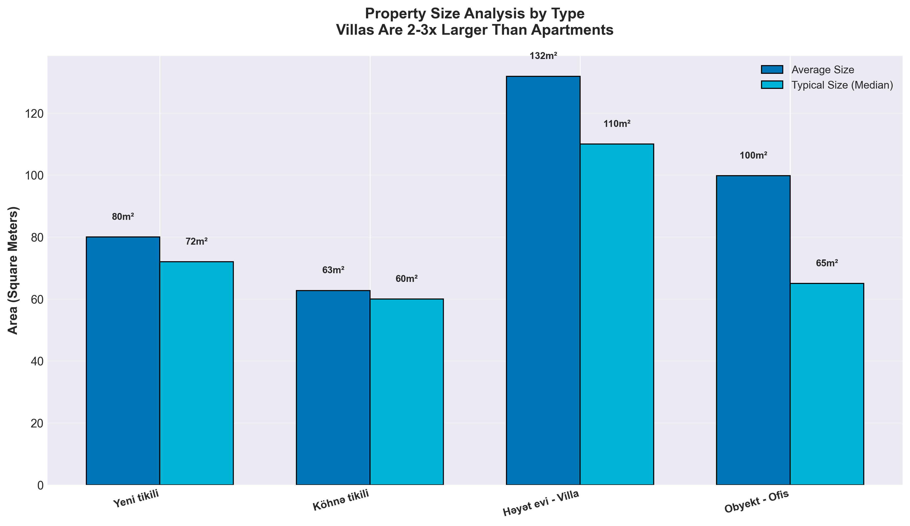
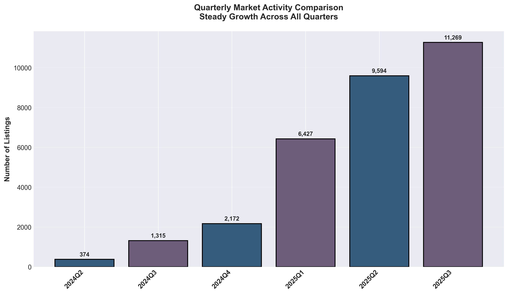
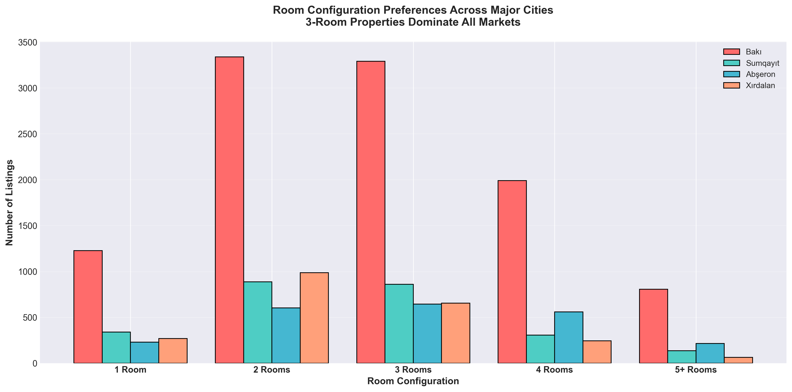
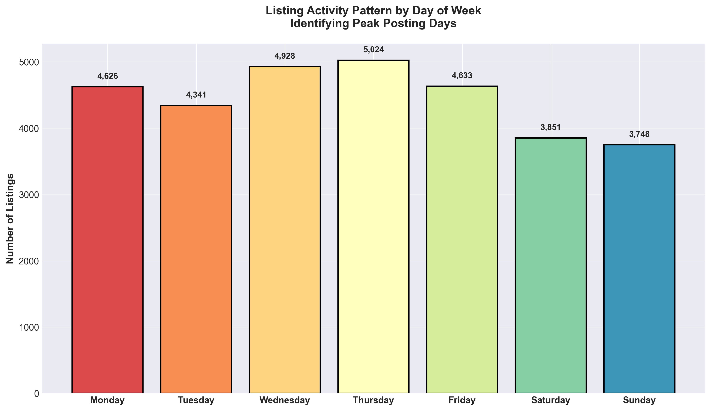

# Azerbaijan Real Estate Market Analysis
## Executive Summary Report

---

## Overview

This analysis examines **31,151 real estate listings** across Azerbaijan's property market, revealing critical insights about market structure, geographic distribution, property preferences, and growth trends. The findings provide actionable intelligence for strategic decision-making in investment, market entry, portfolio optimization, and competitive positioning.

---

## Key Findings at a Glance

### Market Size & Growth
- **Total Market Listings**: 31,151 properties
- **Growth Rate**: 5x increase in listing activity from October 2024 (870 listings) to July 2025 (4,533 listings)
- **Market Momentum**: Sustained growth across all quarters, indicating a robust and expanding market

### Geographic Concentration
- **Bakı dominates** with 39.3% market share (12,256 listings)
- **Top 4 cities** control 66% of the market
- **Clear regional hierarchy** with distinct market characteristics

### Property Preferences
- **Most common configuration**: 3-room properties (30.8% of market)
- **Dominant property type**: Houses and Villas (35.8%)
- **Strong demand** for 2-4 room properties (80.6% of all listings)

---

## Detailed Business Insights

### 1. Geographic Market Distribution



**What This Shows:**
The real estate market is heavily concentrated in a few major cities, with Bakı leading significantly.

**Key Insights:**
- **Bakı** accounts for nearly 40% of all listings (12,256 properties)
- **Sumqayıt** ranks second with 9.7% (3,025 listings)
- **Abşeron** and **Xırdalan** together represent 17.2% of the market
- Top 5 cities control over 72% of total market activity

**Business Implications:**
- **For Investors**: Bakı offers the deepest liquidity and largest transaction volume, but also faces the most competition
- **For Developers**: Secondary cities like Sumqayıt and Xırdalan present growth opportunities with less saturation
- **For Agents**: Geographic specialization in top markets can drive efficiency and expertise
- **Risk Consideration**: Heavy concentration in Bakı means market-wide strategies are vulnerable to Bakı-specific economic conditions

---

### 2. Property Type Distribution



**What This Shows:**
The market composition across different property categories and what sellers are offering.

**Key Insights:**
- **Houses & Villas** dominate at 35.8% (11,157 listings)
- **New Construction** represents 23.8% (7,419 listings)
- **Land parcels** account for 19.2% (5,980 listings)
- **Older apartment buildings** make up 13.2% (4,104 listings)
- **Commercial/Office properties** represent 6.5% (2,024 listings)

**Business Implications:**
- **Market Maturity**: High volume of land and houses suggests active development and suburban expansion
- **Construction Activity**: Nearly 1 in 4 listings being new construction indicates healthy building pipeline
- **Investment Mix**: Diverse property types allow for portfolio diversification strategies
- **Opportunity**: Commercial real estate represents smaller but potentially less competitive segment

---

### 3. Property Size Preferences



**What This Shows:**
Consumer and market preferences for property sizes based on room count.

**Key Insights:**
- **3-room properties** are most common (30.8%)
- **2-room properties** follow closely (28.1%)
- **4-room properties** represent 21.7%
- **Combined 2-4 room segment** captures 80.6% of market
- **Large properties** (5+ rooms) are niche at 4.1%

**Business Implications:**
- **Target Market**: Middle-market families seeking 2-4 room properties represent the core customer base
- **Development Strategy**: Focus on 3-room layouts for maximum market appeal
- **Pricing Power**: Properties outside the 2-4 room range may require longer sales cycles
- **Luxury Segment**: 5+ room properties serve a limited but potentially high-value niche

---

### 4. Market Activity Timeline



**What This Shows:**
How listing activity has evolved over time, revealing market momentum and seasonality.

**Key Insights:**
- **Explosive growth**: From 870 listings in October 2024 to 4,533 in July 2025
- **Peak activity**: July 2025 recorded the highest monthly volume
- **Consistent upward trend** with minor seasonal fluctuations
- **No significant decline periods** observed

**Business Implications:**
- **Market Confidence**: Sustained growth indicates strong seller confidence and market liquidity
- **Supply Dynamics**: Increasing inventory suggests healthy market conditions, not oversupply
- **Timing Strategy**: Summer months (May-July) show peak activity, potentially ideal for launches
- **Forward Outlook**: Trajectory suggests continued market expansion in near term
- **Resource Planning**: Businesses should scale operations to match growing market volumes

---

### 5. Property Type Mix Across Major Cities



**What This Shows:**
Each city has a distinct property type composition, revealing local market preferences and urban characteristics.

**Key Insights:**
- **Bakı**: Most balanced market with nearly equal mix of villas (29%), new construction (28%), and older apartments (21%)
- **Sumqayıt**: Apartment-focused market with new construction (32%) and older buildings (26%) dominating
- **Gəncə**: Villa-heavy market (39%), reflecting more suburban/residential character
- **Abşeron**: Strong villa presence (41%) with significant land availability (26%)
- **Xırdalan**: Mixed development profile

**Business Implications:**
- **Market Entry Strategy**: Product mix should align with local preferences (apartments in Sumqayıt, villas in Gəncə)
- **Competitive Positioning**: Different cities require different value propositions
- **Development Focus**: Bakı can absorb diverse project types; secondary cities require specialization
- **Land Banking**: Abşeron and Gəncə show high land availability, indicating development potential

---

### 6. Regional Hotspots in Bakı



**What This Shows:**
The most active neighborhoods and districts within Bakı, where supply is concentrated.

**Key Insights:**
- **Sabunçu** leads with 1,737 listings (14% of Bakı market)
- **Xətai** follows with 1,402 listings
- **Top 5 regions** account for over 50% of Bakı's listings
- Clear neighborhood hierarchy indicates established demand patterns

**Business Implications:**
- **Location Strategy**: Sabunçu, Xətai, and Xəzər are proven high-volume markets
- **Market Depth**: These regions offer liquidity for both buyers and sellers
- **Price Discovery**: High listing volumes enable better market pricing and faster transactions
- **Competition**: Top regions face more competition; emerging areas may offer opportunities
- **Infrastructure Investment**: High listing concentrations often correlate with better amenities and transport

---

### 7. Property Size Analysis



**What This Shows:**
Average and typical square footage for different property types, revealing space and value expectations.

**Key Insights:**
- **New apartments** average 147 m² (median: 72 m²)
- **Older apartments** average 66 m² (median: 60 m²)
- **Villas** are significantly larger, averaging 110 m² median
- **Commercial properties** average 75 m² median

**Business Implications:**
- **Value Proposition**: New construction offers 2x more space than older apartments
- **Buyer Expectations**: Median values reveal what typical buyers are seeking
- **Development Planning**: Target 70-80 m² for new apartments to hit market sweet spot
- **Renovation Market**: Older apartments are smaller, creating upgrade demand
- **Price Per Square Meter**: Differences in size affect price comparisons across property types

---

### 8. Quarterly Market Performance



**What This Shows:**
Market activity aggregated by quarter, smoothing out monthly volatility to reveal underlying trends.

**Key Insights:**
- **Consistent quarterly growth** with each quarter exceeding the previous
- **Q3 2025** shows strongest performance
- **No quarter-over-quarter declines** observed
- Market maintains momentum across seasonal variations

**Business Implications:**
- **Investment Timing**: No clear "best" quarter—market remains consistently active
- **Budget Cycles**: Quarterly planning can assume continued growth
- **Risk Assessment**: Absence of downturns suggests market stability
- **Capacity Planning**: Anticipate continued volume increases in operational planning

---

### 9. Room Distribution Across Cities



**What This Shows:**
How room preferences vary by city, revealing different demographic and buyer profiles.

**Key Insights:**
- **3-room properties dominate** in Bakı, Sumqayıt, and Abşeron
- **Xırdalan** shows higher concentration of 2-room properties
- **Bakı** has the most balanced distribution, serving diverse needs
- **Larger properties** (4+ rooms) more common in Abşeron

**Business Implications:**
- **Product Development**: Xırdalan buyers prefer smaller, possibly more affordable units
- **Demographic Targeting**: City-specific room preferences reflect family sizes and affordability
- **Portfolio Strategy**: Diversify across cities to capture different buyer segments
- **Price Points**: Smaller units in Xırdalan may serve entry-level market; larger units in Abşeron target families

---

### 10. Weekly Activity Patterns



**What This Shows:**
When properties are being listed during the week, revealing seller and market behavior patterns.

**Key Insights:**
- **Weekday listings dominate** over weekends
- **Mid-week peaks** suggest professional/agent-driven activity
- **Consistent patterns** across all days indicate active market

**Business Implications:**
- **Marketing Timing**: New listings peak mid-week; align marketing campaigns accordingly
- **Agent Productivity**: Weekday focus suggests professional management of listings
- **Buyer Behavior**: While listings peak mid-week, buyers may browse more on weekends
- **Operational Planning**: Schedule viewings and client meetings around weekly patterns

---

## Strategic Recommendations

### For Real Estate Investors

1. **Geographic Focus**: Prioritize Bakı for liquidity and transaction volume, but diversify into Sumqayıt and Xırdalan for growth exposure
2. **Property Type Strategy**:
   - Core holdings: 3-room apartments in new construction
   - Growth plays: Land in Abşeron, villas in developing suburbs
   - Value opportunities: Older apartments in top Bakı regions for renovation plays
3. **Timing**: Market growth suggests opportune entry point before further price appreciation
4. **Portfolio Mix**: Balance between high-turnover 2-3 room apartments and higher-margin villa developments

### For Property Developers

1. **Product Design**: Focus on 3-room units averaging 70-80 m² for mass market appeal
2. **Location Selection**:
   - Bakı: All property types viable; focus on underserved regions outside top 5
   - Sumqayıt: Apartment-focused developments
   - Gəncə/Abşeron: Villa and house projects
3. **Market Timing**: Capitalize on current growth momentum with new launches
4. **Differentiation**: In saturated Bakı market, quality and location premium are key differentiators

### For Real Estate Agencies

1. **Specialization**: Build expertise in high-volume segments (3-room properties, villas, Bakı market)
2. **Regional Coverage**: Establish presence in top 5 Bakı regions for maximum deal flow
3. **Service Mix**: Offer both new construction and resale services to capture full market
4. **Technology Investment**: With 31,000+ listings and growing, digital tools are essential for efficiency

### For Market Entrants

1. **Market Selection**: Xırdalan and Sumqayıt offer less competition than Bakı while maintaining volume
2. **Niche Opportunities**:
   - Commercial real estate (6.5% of market but likely underserved)
   - Luxury segment (5+ rooms, only 4% of listings)
   - Land development (19% of listings, active development market)
3. **Competitive Analysis**: Understand regional preferences before entry
4. **Partnership Strategy**: Consider partnerships with local players in top regions

---

## Risk Factors and Considerations

### Market Concentration Risk
- Heavy dependence on Bakı (40% of market) means citywide shocks could significantly impact national market
- Mitigation: Diversify across multiple cities and property types

### Rapid Growth Sustainability
- 5x growth in 9 months is exceptional—may not be sustainable long-term
- Mitigation: Monitor leading indicators for market cooling; maintain conservative assumptions in projections

### Data Limitations
- Price data not available in this dataset, limiting valuation and return analysis
- Recommendation: Supplement with local pricing intelligence for complete market picture

### Regulatory Environment
- Real estate markets are subject to policy changes, zoning laws, and economic conditions
- Recommendation: Monitor government policies on construction, foreign investment, and mortgage markets

---

## Conclusion

Azerbaijan's real estate market demonstrates **strong momentum, clear structure, and significant opportunity**. The market's concentration in Bakı, preference for mid-size properties (2-4 rooms), and dominance of villas and new construction create a clear roadmap for strategic decision-making.

**Key Takeaways:**
- **Market is growing rapidly** with 5x expansion in less than a year
- **Geographic and property type preferences are well-defined**, enabling targeted strategies
- **Volume and diversity support** multiple business models and investment approaches
- **Secondary cities present growth opportunities** with less competition than Bakı

**Actionable Next Steps:**
1. Conduct price analysis to complement volume and preference insights
2. Perform deeper regional analysis within top cities for micro-market opportunities
3. Assess competitive landscape and entry barriers in target segments
4. Develop financial models incorporating growth assumptions and risk scenarios

---

## Appendix: Data Summary

- **Total Listings Analyzed**: 31,151
- **Geographic Coverage**: 15+ cities across Azerbaijan
- **Property Types**: 5 major categories (Villas, New Construction, Old Construction, Land, Commercial)
- **Time Period**: October 2024 - September 2025
- **Data Completeness**: 99.2% description data, 78.8% room data, 75.8% area data

---

## How to Regenerate Charts

To regenerate all visualizations from the dataset:

```bash
python generate_charts.py
```

All charts will be saved to the `charts/` directory.

---

**Report Generated**: December 2025
**Data Source**: Binalar.az Real Estate Listings
**Analysis Scope**: Market structure, geographic distribution, property characteristics, and activity trends

---

*This report is intended for business decision-making purposes. All insights are based on listing data and should be supplemented with pricing, transaction, and economic data for comprehensive market assessment.*